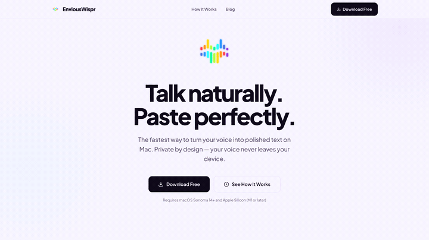

<p align="center">
  
</p>

<h1 align="center">EnviousWispr</h1>

<p align="center">
  <strong>Talk naturally. Paste perfectly.</strong><br/>
  Free, on-device AI dictation and speech-to-text for macOS.<br/>
  Powered by Apple Silicon. No cloud, no account, your voice never leaves your Mac.
</p>

<p align="center">
  <a href="https://github.com/saurabhav88/EnviousWispr/releases/latest"></a>
  <a href="https://github.com/saurabhav88/EnviousWispr/releases/latest/download/EnviousWispr.dmg"></a>
  <a href="https://enviouswispr.com"></a>
  <a href="https://x.com/EnviousLabs"></a>
</p>

<p align="center">
  
</p>

---

## Demo

https://github.com/user-attachments/assets/e636e1a0-a0d1-4f7c-be0a-b7c907c6d5ab

## What is this?

EnviousWispr is a free AI dictation app for macOS that runs entirely on-device. It uses Whisper and Parakeet speech-to-text models on Apple Silicon to transcribe your voice locally, polishes the output with an optional LLM, and pastes clean text into whatever app you're working in. The entire pipeline runs in under 2 seconds.

No cloud. No account required. No subscription. No audio ever leaves your Mac. Works fully offline.

## Why EnviousWispr?

| | EnviousWispr | Cloud dictation services |
|---|---|---|
| **Privacy** | 100% on-device transcription | Audio uploaded to servers |
| **Speed** | Sub-second pipeline, paste-on-stop | Network round-trip latency |
| **Models** | Parakeet v3 (NVIDIA NeMo) + WhisperKit (OpenAI Whisper) | Single vendor model |
| **Polish** | Optional LLM cleanup (GPT, Gemini) with your own keys | Basic punctuation only |
| **Cost** | One-time purchase, no subscription for core features | Monthly subscription |
| **Works offline** | Yes, fully functional without internet | No |

## How it works

```
Press hotkey  -->  Record  -->  Transcribe  -->  Polish (optional)  -->  Paste
    ~0ms          live        ~400-800ms         ~200-500ms            instant
```

1. **Press your hotkey** from any app. Toggle mode or push-to-talk, your choice.
2. **Speak naturally.** Silero VAD detects when you stop talking and ends recording automatically.
3. **On-device transcription.** Choose Parakeet v3 (fastest, 25 languages) or WhisperKit (99 languages).
4. **AI polish** (optional). Clean up grammar, punctuation, and formatting via OpenAI or Gemini with your own API key.
5. **Text lands in your clipboard** and optionally auto-pastes into the active app.

> See the full interactive pipeline demo at [enviouswispr.com/how-it-works](https://enviouswispr.com/how-it-works)

## Supported Models

| Model | Best for | Languages | Download size | Hardware |
|---|---|---|---|---|
| **Parakeet TDT v3** | Fastest multilingual dictation (default) | 25 languages | ~500 MB | Apple Silicon |
| **WhisperKit** (Whisper Large v3 Turbo) | Broadest language coverage | 99 languages | ~800 MB | Apple Silicon |

Both models run entirely on-device using CoreML. First launch downloads and compiles the model; subsequent launches are instant.

## Features

- **Dual ASR engines** with [Parakeet v3](https://github.com/FluidInference/FluidAudio) (NVIDIA NeMo) and [WhisperKit](https://github.com/argmaxinc/WhisperKit) (OpenAI Whisper)
- **Voice Activity Detection** via Silero VAD for hands-free stop
- **LLM polish** with OpenAI GPT or Google Gemini (bring your own API key)
- **Custom vocabulary** for names, brands, and technical terms the ASR might miss
- **Global hotkey** with toggle and push-to-talk modes
- **Auto-paste** directly into the active app, or just copy to clipboard
- **Transcript history** for browsing, searching, and reviewing past dictations
- **Menu bar native** with minimal footprint
- **Auto-updates** via Sparkle

## Quick Start

1. Download [EnviousWispr.dmg](https://github.com/saurabhav88/EnviousWispr/releases/latest/download/EnviousWispr.dmg) from the latest release
2. Drag to Applications, launch
3. Grant **Microphone** and **Accessibility** permissions when prompted
4. Set your preferred hotkey in Settings > Shortcuts
5. Start talking

**Optional:** Add an OpenAI or Gemini API key in Settings > AI Polish for transcript cleanup.

## Requirements

- macOS 14 (Sonoma) or later
- Apple Silicon (M1 or newer)

## Building from Source

```bash
git clone https://github.com/saurabhav88/EnviousWispr.git
cd EnviousWispr
swift build
```

Dependencies resolve automatically via Swift Package Manager. First build takes several minutes as ML models compile.

For a distributable `.app` bundle and DMG:

```bash
./scripts/build-dmg.sh
```

Requires macOS 14+ with Swift 6.0+ toolchain (Xcode Command Line Tools or full Xcode).

## Architecture

The app follows a pipeline state machine: **idle --> recording --> transcribing --> polishing --> complete**.

Key design choices:
- **Swift 6 strict concurrency** with full actor isolation
- **Dual pipeline architecture** with deliberately separate Parakeet and WhisperKit backends (isolation is a feature, not tech debt)
- **Heart & Limbs pattern** where the critical path (audio, ASR, paste) never fails, and features (polish, custom words, filler removal) degrade gracefully
- **Local-first** with LLM polish as an opt-in enhancement using your own keys

## Contributing

Contributions are welcome. Please open an issue to discuss significant changes before submitting a PR.

This project uses conventional commits: `feat(scope):`, `fix(scope):`, `refactor(scope):`.

## Privacy

EnviousWispr is built on a simple principle: **your voice is yours.**

- Audio is captured, transcribed, and discarded locally. Nothing is uploaded, stored, or shared.
- LLM polish (if enabled) sends only the text transcript to your chosen provider using your own API key. Audio is never sent.
- Anonymous product analytics (PostHog) can be disabled in Settings.
- Crash reporting (Sentry) contains no transcript content, audio, or personal data.

## Connect

- **Website:** [enviouswispr.com](https://enviouswispr.com)
- **X:** [@EnviousLabs](https://x.com/EnviousLabs)
- **Email:** hello@enviouswispr.com

Built by [Envious Labs](https://enviouslabs.co)

## License

EnviousWispr is source-available under the [Business Source License 1.1](LICENSE). You may view, fork, and modify the code for personal, non-commercial use. Commercial use requires a license from Envious Labs. The code converts to Apache 2.0 on March 10, 2030.

For commercial licensing inquiries: hello@enviouswispr.com
